# 🎥 YouTube Content Insights

A comprehensive web scraping and analysis tool for YouTube content that provides deep insights into video performance, audience sentiment, trending patterns, and content optimization strategies.

## ✨ Features

### 🔍 Data Scraping
- **Video Search & Scraping**: Search and extract detailed video metadata
- **Channel Analysis**: Comprehensive channel information and recent videos
- **Trending Content**: Scrape trending videos across different categories
- **Comment Extraction**: Extract and analyze video comments for sentiment analysis
 
### 📊 Advanced Analytics
- **Channel Performance Analysis**: Compare channels, analyze growth patterns, and identify success factors
- **Sentiment Analysis**: AI-powered sentiment analysis of video comments with emotion detection
- **Trending Analysis**: Identify viral patterns, optimal content duration, and trending keywords
- **Content Optimization**: Title analysis, thumbnail effectiveness, and engagement metrics

### 🎵 Smart Features
- **Playlist Generation**: Create curated playlists based on performance, themes, or discovery algorithms
- **Thumbnail Analysis**: Visual analysis of thumbnails including color patterns and composition
- **Competitive Intelligence**: Compare strategies across multiple channels
- **Trend Prediction**: Identify emerging patterns and content opportunities

### 📈 Visualization & Reporting
- **Interactive Dashboards**: Web-based dashboards with real-time data
- **Performance Reports**: Comprehensive PDF/PNG reports with key insights
- **Data Visualization**: Charts, graphs, and infographics for easy understanding
- **Export Capabilities**: CSV, JSON, and database export options

### 💾 Data Management
- **SQLite Database**: Persistent storage for all scraped data and analysis results
- **Data Processing**: Clean, normalize, and structure raw data
- **Backup & Recovery**: Database backup and data cleanup utilities
- **Historical Tracking**: Track trends and changes over time

## 🔄 Application Workflow

```mermaid
flowchart TD
    A[🚀 Start Application] --> B{Choose Interface}
    B -->|Web Interface| C[🌐 Streamlit App]
    B -->|Command Line| D[📱 CLI Menu]
    
    C --> E[⚙️ Configure Settings]
    D --> E
    
    E --> F[🔧 Setup Browser & ChromeDriver]
    F --> G[🔍 Data Scraping Module]
    
    G --> H{Scraping Type}
    H -->|Video Search| I[🎥 Search Videos by Keywords]
    H -->|Channel Analysis| J[📺 Analyze Specific Channels]
    H -->|Trending Content| K[🔥 Scrape Trending Videos]
    H -->|Comments| L[💬 Extract Video Comments]
    
    I --> M[🗄️ Store in SQLite Database]
    J --> M
    K --> M
    L --> M
    
    M --> N[📊 Data Processing & Cleaning]
    N --> O{Analysis Type}
    
    O -->|Channel Performance| P[📈 Channel Analytics]
    O -->|Sentiment Analysis| Q[💭 Comment Sentiment]
    O -->|Trending Patterns| R[🔥 Trend Analysis]
    O -->|Thumbnail Analysis| S[🖼️ Visual Analysis]
    
    P --> T[📊 Generate Insights]
    Q --> T
    R --> T
    S --> T
    
    T --> U{Output Format}
    U -->|Interactive Dashboard| V[📈 Plotly Visualizations]
    U -->|Reports| W[📄 PDF/PNG Reports]
    U -->|Playlists| X[🎵 Generated Playlists]
    U -->|Data Export| Y[📥 CSV/JSON Export]
    
    V --> Z[✅ Results & Recommendations]
    W --> Z
    X --> Z
    Y --> Z
    
    Z --> AA{Continue Analysis?}
    AA -->|Yes| G
    AA -->|No| BB[🏁 End Session]
    
    %% Styling with high contrast colors
    style A fill:#1e88e5,stroke:#0d47a1,stroke-width:3px,color:#ffffff
    style B fill:#ff6f00,stroke:#e65100,stroke-width:3px,color:#ffffff
    style C fill:#7b1fa2,stroke:#4a148c,stroke-width:3px,color:#ffffff
    style D fill:#388e3c,stroke:#1b5e20,stroke-width:3px,color:#ffffff
    style E fill:#d32f2f,stroke:#b71c1c,stroke-width:3px,color:#ffffff
    style F fill:#f57c00,stroke:#ef6c00,stroke-width:3px,color:#ffffff
    style G fill:#303f9f,stroke:#1a237e,stroke-width:3px,color:#ffffff
    style H fill:#c2185b,stroke:#880e4f,stroke-width:3px,color:#ffffff
    style I fill:#00796b,stroke:#004d40,stroke-width:3px,color:#ffffff
    style J fill:#5d4037,stroke:#3e2723,stroke-width:3px,color:#ffffff
    style K fill:#f44336,stroke:#d32f2f,stroke-width:3px,color:#ffffff
    style L fill:#9c27b0,stroke:#6a1b9a,stroke-width:3px,color:#ffffff
    style M fill:#ff9800,stroke:#f57c00,stroke-width:4px,color:#000000
    style N fill:#2196f3,stroke:#1976d2,stroke-width:3px,color:#ffffff
    style O fill:#e91e63,stroke:#c2185b,stroke-width:3px,color:#ffffff
    style P fill:#4caf50,stroke:#388e3c,stroke-width:3px,color:#ffffff
    style Q fill:#ff5722,stroke:#d84315,stroke-width:3px,color:#ffffff
    style R fill:#795548,stroke:#5d4037,stroke-width:3px,color:#ffffff
    style S fill:#607d8b,stroke:#455a64,stroke-width:3px,color:#ffffff
    style T fill:#ffeb3b,stroke:#f57f17,stroke-width:4px,color:#000000
    style U fill:#9e9e9e,stroke:#616161,stroke-width:3px,color:#ffffff
    style V fill:#00bcd4,stroke:#0097a7,stroke-width:3px,color:#ffffff
    style W fill:#8bc34a,stroke:#689f38,stroke-width:3px,color:#000000
    style X fill:#ffc107,stroke:#ff8f00,stroke-width:3px,color:#000000
    style Y fill:#3f51b5,stroke:#303f9f,stroke-width:3px,color:#ffffff
    style Z fill:#4caf50,stroke:#2e7d32,stroke-width:4px,color:#ffffff
    style AA fill:#ff9800,stroke:#f57c00,stroke-width:3px,color:#ffffff
    style BB fill:#f44336,stroke:#c62828,stroke-width:3px,color:#ffffff
```



## 🚀 Quick Start

### Prerequisites
- Python 3.8 or higher
- Chrome or Brave browser
- ChromeDriver (matching your browser version)

### Installation

1. **Clone the repository**
```bash
git clone https://github.com/yourusername/youtube-content-insights.git
cd youtube-content-insights
```

2. **Install dependencies**
```bash
pip install -r requirements.txt
```

3. **Download ChromeDriver**
   - Visit [ChromeDriver Downloads](https://chromedriver.chromium.org/)
   - Download the version matching your browser
   - Extract and note the path to the executable

4. **Run the application**

**Option A: Web Interface (Recommended)**
```bash
python run_web_app.py
# or
streamlit run streamlit_app.py
```

**Option B: Command Line Interface**
```bash
python main.py
```

### First Time Setup

When you first run the application, you'll be prompted to configure:
- Path to your browser executable
- Path to ChromeDriver executable
- Whether to run in headless mode (recommended for automation)

## 📋 Usage Guide

### 🌐 Web Interface (Streamlit)

The modern web interface provides an intuitive point-and-click experience:

#### **Main Features:**
- **🏠 Dashboard**: Overview of all data and quick actions
- **🔍 Data Scraping**: Interactive forms for video/channel scraping
- **📊 Analytics**: Visual analysis with charts and graphs
- **🎵 Playlist Generator**: Drag-and-drop playlist creation
- **📈 Visualizations**: Interactive Plotly charts and dashboards
- **💾 Database**: Easy data management and export

#### **Key Benefits:**
- ✅ No command-line knowledge required
- ✅ Real-time visual feedback
- ✅ Interactive charts and graphs
- ✅ Easy data export and sharing
- ✅ Mobile-responsive design
- ✅ Progress bars and status updates

### 📱 Command Line Interface

### Main Menu Options

1. **🔍 Scrape YouTube Data**
   - Search and scrape videos by keywords
   - Analyze specific channels
   - Extract trending content
   - Collect video comments

2. **📊 Analyze Channel Performance**
   - Single channel deep-dive analysis
   - Multi-channel comparison
   - Performance metrics and insights

3. **💭 Analyze Sentiment**
   - Comment sentiment analysis
   - Emotion detection
   - Audience reception insights

4. **🔥 Analyze Trending Content**
   - Trending pattern analysis
   - Viral factor identification
   - Content optimization recommendations

5. **🎵 Generate Playlists**
   - Best performing videos
   - Themed collections
   - Hidden gems discovery
   - Balanced duration playlists

6. **🖼️ Analyze Thumbnails**
   - Visual pattern analysis
   - Color and composition insights
   - Performance correlation

7. **📈 Create Visualizations**
   - Interactive dashboards
   - Performance reports
   - Summary infographics

8. **💾 Database Operations**
   - View statistics
   - Export data
   - Backup and cleanup

### 🌐 Web Interface Workflow

1. **🚀 Launch**: Run `python run_web_app.py` and open http://localhost:8501
2. **🔧 Setup**: Configure browser and ChromeDriver paths in Settings
3. **🔍 Scrape**: Use the Data Scraping page to collect YouTube data
4. **📊 Analyze**: Run analytics on your scraped data
5. **📈 Visualize**: Create interactive charts and dashboards
6. **📥 Export**: Download results as CSV, JSON, or images

### 📱 Command Line Workflow

1. **Scrape Data**: Start by scraping videos for your topic of interest
2. **Analyze Performance**: Run channel analysis to understand success patterns
3. **Sentiment Analysis**: Analyze comments to gauge audience reception
4. **Generate Insights**: Create visualizations and reports
5. **Optimize Strategy**: Use insights to improve content strategy

## 🏗️ Project Structure

```
youtube-content-insights/
├── src/
│   ├── scraper.py              # Core YouTube scraper
│   ├── data_processor.py       # Data cleaning and processing
│   ├── analyzer_channel.py     # Channel analysis logic
│   ├── analyzer_sentiment.py   # Sentiment analysis
│   ├── analyzer_trends.py      # Trending content analysis
│   ├── generator_playlist.py   # Playlist generation
│   ├── generator_thumbnail.py  # Thumbnail analysis
│   ├── visualizer.py          # Data visualization
│   ├── database.py            # Database management
│   └── __init__.py
├── main.py                    # Command-line application entry point
├── streamlit_app.py          # Web interface (Streamlit)
├── run_web_app.py            # Quick launcher for web app
├── requirements.txt          # Python dependencies
├── README.md                # This file
└── youtube_insights.db      # SQLite database (created on first run)
```

## 🔧 Configuration

### Browser Setup
The application supports multiple browsers:
- **Chrome**: Most tested and recommended
- **Brave**: Privacy-focused alternative
- **Edge**: Microsoft's browser (experimental)

### ChromeDriver Setup
Ensure ChromeDriver version matches your browser:
```bash
# Check Chrome version
google-chrome --version

# Download matching ChromeDriver
# Extract to a known location
# Provide path during setup
```

### Headless Mode
For automated analysis, enable headless mode:
- Faster execution
- No browser window
- Better for server environments

## 📊 Analysis Capabilities

### Channel Analysis
- **Performance Metrics**: Views, engagement rates, consistency scores
- **Content Patterns**: Duration analysis, upload frequency, title optimization
- **Growth Trends**: Historical performance tracking
- **Competitive Analysis**: Multi-channel comparisons

### Sentiment Analysis
- **Comment Classification**: Positive, negative, neutral sentiment
- **Emotion Detection**: Joy, anger, sadness, fear, surprise, disgust
- **Engagement Correlation**: Sentiment vs. video performance
- **Temporal Analysis**: Sentiment changes over time

### Trending Analysis
- **Viral Factors**: What makes content go viral
- **Content Patterns**: Optimal duration, title formats, timing
- **Keyword Trends**: Popular topics and phrases
- **Category Analysis**: Performance across different content types

## 📈 Visualization Features

### Interactive Dashboards
- Real-time data updates
- Filterable charts and graphs
- Export capabilities
- Mobile-responsive design

### Report Generation
- **Performance Reports**: Comprehensive analysis summaries
- **Comparison Charts**: Side-by-side channel comparisons
- **Trend Analysis**: Visual trend identification
- **Summary Infographics**: Key insights at a glance

## 💾 Database Schema

The application uses SQLite with the following main tables:
- `videos`: Video metadata and performance data
- `channels`: Channel information and statistics
- `comments`: Comment text and sentiment scores
- `analysis_results`: Stored analysis outputs
- `playlists`: Generated playlist data
- `trending_snapshots`: Historical trending data

## 🔒 Privacy & Ethics

### Data Collection
- Only public YouTube data is collected
- No personal information is stored
- Respects YouTube's robots.txt and terms of service

### Rate Limiting
- Built-in delays to avoid overwhelming servers
- Configurable request intervals
- Respectful scraping practices

### Data Storage
- Local SQLite database
- No data sent to external servers
- User controls all data retention

## 🛠️ Advanced Features

### Custom Analysis
```python
# Example: Custom analysis script
from src.analyzer_channel import ChannelAnalyzer

analyzer = ChannelAnalyzer()
results = analyzer.analyze_single_channel(channel_data, videos_data)
```

### API Integration
The modular design allows easy integration with:
- YouTube Data API (for additional metadata)
- Social media APIs (for cross-platform analysis)
- Analytics platforms (for deeper insights)

### Extensibility
- Plugin architecture for custom analyzers
- Configurable data processors
- Custom visualization templates

## 🐛 Troubleshooting

### Common Issues

1. **ChromeDriver Version Mismatch**
   ```
   Error: ChromeDriver version incompatible
   Solution: Download matching ChromeDriver version
   ```

2. **Selenium Timeout Errors**
   ```
   Error: Element not found
   Solution: Increase timeout values or check internet connection
   ```

3. **Memory Issues with Large Datasets**
   ```
   Error: Out of memory
   Solution: Process data in smaller batches
   ```

### Debug Mode
Enable detailed logging:
```python
import logging
logging.basicConfig(level=logging.DEBUG)
```

## 🤝 Contributing

We welcome contributions! Please see our contributing guidelines:

1. Fork the repository
2. Create a feature branch
3. Make your changes
4. Add tests if applicable
5. Submit a pull request

### Development Setup
```bash
# Clone your fork
git clone https://github.com/yourusername/youtube-content-insights.git

# Create virtual environment
python -m venv venv
source venv/bin/activate  # On Windows: venv\Scripts\activate

# Install development dependencies
pip install -r requirements.txt
pip install pytest pytest-cov  # For testing
```

## 📄 License

This project is licensed under the MIT License - see the [LICENSE](LICENSE) file for details.


*Disclaimer: This tool is for educational and research purposes. Please respect YouTube's terms of service and rate limits when using this application.*
